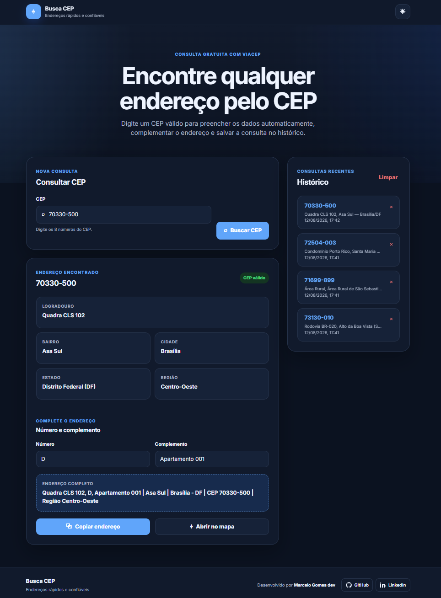
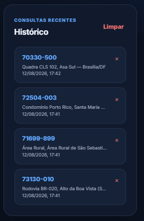
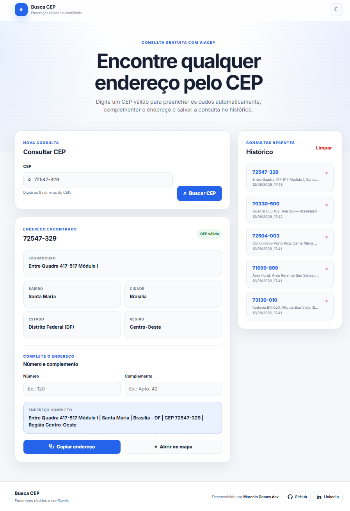

<p align="center">
  
</p>

<p align="center">
  
</p>

<p align="center">
  <a href="https://marcelogomesdev.github.io/busca-cep-atualizado/" target="_blank">
    
  </a>
</p>

# 📍 Busca CEP

Aplicação web responsiva para **consultar endereços brasileiros de forma rápida e prática** utilizando a API pública do **ViaCEP**.

O projeto oferece validação de CEP, preenchimento automático do endereço, integração com mapas, histórico de consultas, armazenamento local e suporte aos modos claro e escuro.

## 🌐 Acessar o projeto

Após publicar no GitHub Pages, acesse:

`https://SEU-USUARIO.github.io/busca-cep/`

## ✨ Funcionalidades

* 🔎 Consulta de CEP utilizando a API ViaCEP.
* ✅ Validação automática do CEP informado.
* 📍 Preenchimento de logradouro, bairro, cidade, estado e região.
* 🏠 Campos adicionais para número e complemento.
* 📝 Montagem automática do endereço completo.
* 📋 Cópia rápida do endereço para a área de transferência.
* 🗺️ Abertura da localização diretamente no Google Maps.
* 🕘 Histórico das 10 consultas mais recentes.
* 🗑️ Remoção individual e limpeza completa do histórico.
* 💾 Persistência de dados utilizando LocalStorage.
* 🔔 Mensagens de sucesso e erro.
* 🌙 Modo claro e escuro com preferência salva.
* 📱 Interface responsiva para desktop, tablet e dispositivos móveis.
* ♿ Recursos básicos de acessibilidade.

## 📸 Demonstração

### 🏠 Tela inicial

<p align="center">
  
</p>

Interface principal da aplicação, desenvolvida para oferecer uma experiência simples e intuitiva durante a consulta de CEPs.

### 🕘 Histórico de consultas

<p align="center">
  
</p>

O histórico mantém as consultas recentes armazenadas no navegador, permitindo acessar rapidamente endereços pesquisados anteriormente.

### ☀️ Modo claro

<p align="center">
  
</p>

A aplicação oferece modos claro e escuro, mantendo a preferência selecionada pelo usuário armazenada no navegador.

## 🛠️ Tecnologias utilizadas

| Tecnologia          | Utilização                             |
| ------------------- | -------------------------------------- |
| **HTML5**           | Estrutura e semântica da aplicação     |
| **CSS3**            | Estilização, responsividade e temas    |
| **JavaScript ES6+** | Lógica, validações e interatividade    |
| **ViaCEP API**      | Consulta de endereços brasileiros      |
| **LocalStorage**    | Histórico e preferências do usuário    |
| **Google Maps**     | Visualização da localização pesquisada |

## 📂 Estrutura do projeto

```text
busca-cep/
├── images/
│   ├── banner.PNG
│   ├── busca-cep-home.PNG
│   ├── busca-cep-historico.PNG
│   └── busca-cep-claro.PNG
├── index.html
├── styles.css
├── script.js
├── README.md
└── LICENSE
```

## 🚀 Como executar localmente

1. Baixe ou clone o repositório.
2. Abra a pasta do projeto no Visual Studio Code.
3. Execute o arquivo `index.html` utilizando a extensão **Live Server**.

Também é possível abrir o `index.html` diretamente no navegador, mas o uso de um servidor local é recomendado durante o desenvolvimento.

## 🌎 API ViaCEP

Os dados dos endereços são obtidos através da API pública e gratuita do **ViaCEP**.

Endpoint utilizado:

```text
https://viacep.com.br/ws/{CEP}/json/
```

A aplicação realiza o tratamento de CEPs inválidos, endereços não encontrados e possíveis erros durante a consulta.

## 💾 Armazenamento local

O **LocalStorage** é utilizado para armazenar:

* histórico das consultas recentes;
* preferência entre modo claro e escuro.

Os dados permanecem armazenados apenas no navegador do usuário. A aplicação não possui backend próprio para armazenamento do histórico.

## 📦 Publicação no GitHub Pages

1. Crie um repositório no GitHub.
2. Envie todos os arquivos do projeto.
3. Acesse **Settings > Pages**.
4. Em **Build and deployment**, selecione **Deploy from a branch**.
5. Escolha a branch `main`.
6. Selecione a pasta `/ (root)`.
7. Clique em **Save**.
8. Aguarde a publicação do projeto.

## 🎯 Objetivo do projeto

O **Busca CEP** foi desenvolvido como projeto de portfólio Front-end com o objetivo de colocar em prática conceitos importantes do desenvolvimento web, incluindo:

* consumo de APIs REST;
* JavaScript assíncrono;
* manipulação do DOM;
* validação de formulários;
* tratamento de erros;
* LocalStorage;
* responsividade;
* acessibilidade;
* experiência do usuário.

## 👨‍💻 Autor

**Marcelo Gomes dev**

Estudante de Análise e Desenvolvimento de Sistemas com foco em desenvolvimento Front-end e Análise de Dados.

* GitHub: [github.com/marcelogomesdev](https://github.com/marcelogomesdev)
* LinkedIn: [linkedin.com/in/marcelogomesdev](https://www.linkedin.com/in/marcelogomesdev/)

## 📄 Licença

Este projeto está distribuído sob a licença **MIT**.

---

<p align="center">
  Desenvolvido por <strong>Marcelo Gomes dev</strong>
</p>
